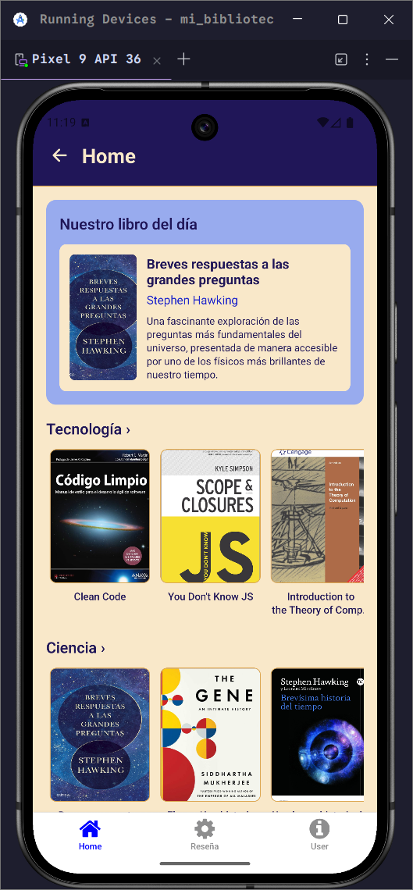
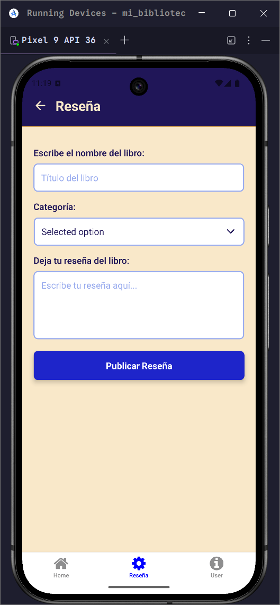
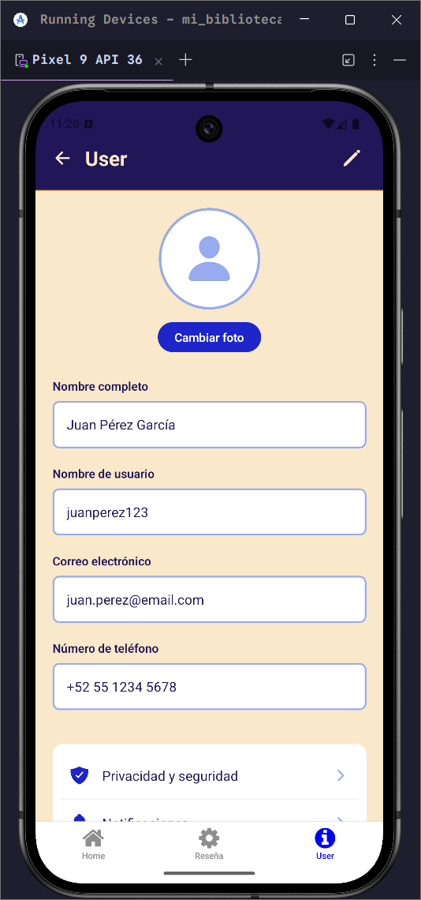

# Bienvenido a la documentación oficial de Dumblee

**Dumblee** es una aplicación móvil desarrollada con **React Native**, **Expo** y **TypeScript**, que funciona como una biblioteca virtual centrada en libros de **programación**, **ciencia** e **historia**. Diseñada para entusiastas del conocimiento, ofrece una experiencia intuitiva y visualmente atractiva para explorar, consultar y descubrir libros de diversas categorías.

##  Características

- Catálogo visual de libros categorizados.
- Imágenes de portadas integradas localmente.
- Interfaz moderna y responsiva.
- Componentes reutilizables en TypeScript.
- Navegación fluida y amigable para el usuario.

## Tecnologías utilizadas

- **React Native** – UI móvil multiplataforma
- **Expo** – Desarrollo rápido y sin complicaciones
- **TypeScript** – Tipado estático para mayor robustez
- **JSON** – Datos de libros estructurados localmente
- **StyleSheet API** – Estilos nativos en línea

## Capturas de pantalla

<p align="center">
  
  
  
  
</p>


## Instalación y ejecución

1. Clona el repositorio:

```bash
git clone https://github.com/AaronSantos-Next11/mi-biblioteca-virtual.git
cd mi-biblioteca-virtual
````

2. Instala las dependencias:

```bash
npm install
# o
yarn install
```

3. Inicia el servidor de desarrollo:

```bash
npx expo start
```

4. Escanea el código QR desde la app de **Expo Go** en tu dispositivo móvil.

## Próximas mejoras

* Buscador por título o autor
* Detalle individual del libro
* Integración con APIs externas (Google Books, Open Library)
* Sistema de favoritos
* Modo oscuro
